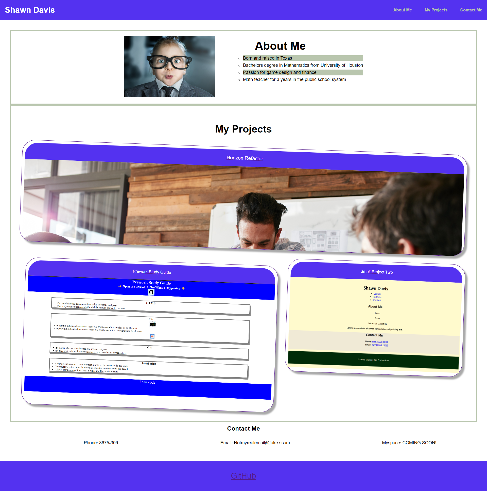

## sample-portfolio

Module Two Challenge

## Description

- What was your motivation? To take a website using html and css
- Why did you build this project? To get practice using html and css
- What problem does it solve? Makes my life easier in the long run
- What did you learn?  How to use html and css in unison to get a great looking website no matter the screen size

## Screenshot

## Link

[Sample portfolio website](https://drprofdavis.github.io/sample-portfolio/)
[Sample portfolio GitHub](https://github.com/DrProfDavis/sample-portfolio)

## Credits

Shawn Davis